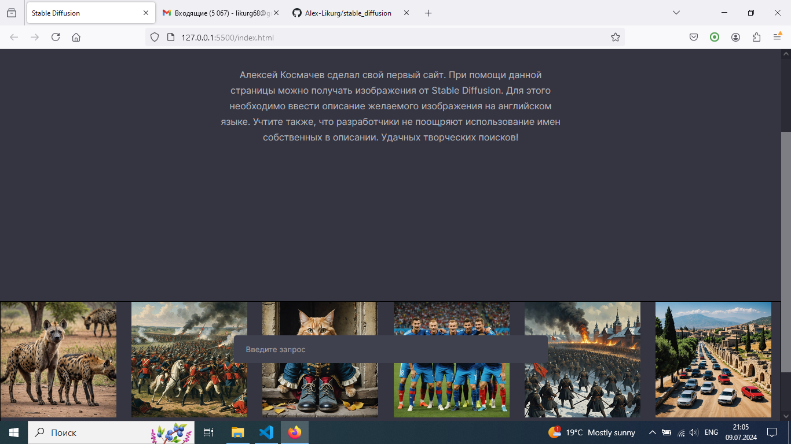

# 🎨 Stable Diffusion Web Client

A simple local web application that connects to your personal Stable Diffusion account and generates AI-powered images from text prompts.

---

## 📌 Features

- 🧠 Uses Stable Diffusion via personal account (no extra model files needed)
- 🌐 Browser-based frontend for prompt input and result display
- 🔄 Node.js backend with MySQL database integration
- ⚙️ API routing via `index.js`, user interface logic via `client.js`
- 💡 Fully local execution — no external model downloads required

---

## 🛠️ Tech Stack

- **Frontend:** HTML, CSS, JavaScript
- **Backend:** Node.js (Express)
- **Database:** MySQL
- **AI Model:** Stable Diffusion (cloud-linked)

---

## 🚀 Getting Started

### 1. Prepare the Frontend

Make sure you have `index.html` and `index.css` in your local folder — they serve as the web interface.

### 2. Run the Backend

Start the server:

```bash
node server.js
```

This will connect to your MySQL database.

### 3. Set Up API Routing

Install and run:

```bash
node index.js
```

This handles the connection to Stable Diffusion and routes image requests.

### 4. Launch Client

Open `index.html` in your browser locally.  
Use the dialog box to enter a text prompt and generate an image.

---

## 🖼️ Example Output

### Generated by prompt:
`"A football player dribbling on a stadium field in ultra realistic style"`


### Screenshot of the running site:



---

## 📁 Project Structure

```
stable_diffusion/
├── index.html         # UI for prompt input
├── index.css          # Styles for the UI
├── index.js           # Handles API requests
├── server.js          # Initializes database connection
├── client.js          # Controls front-end logic
└── README.md
```

---

## 📝 License

This project is licensed under the [MIT License](LICENSE).
